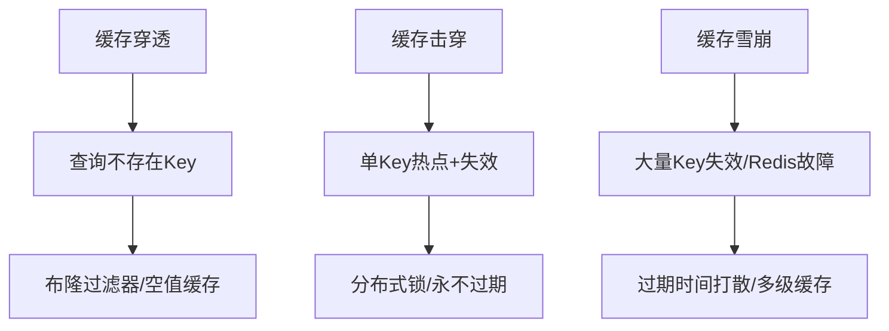

## 面试总结

### 1 自我介绍

面试官你好，我叫周和龙，从事java开发已经接近4年的时间，目前在2家公司工作过，在其中担任java开发，我的技术栈主要以java为主，熟练应用spirngboot、springcloud、redis、activiti等技术框架，熟练掌握前后端联调以及快速排查问题，我最近做的项目是三维可视化项目,我在里面负责GIS数据空间分析和常规业务代码的编写。在平时的工作中，我能够独立完成模块的开发，也会使用一些ai工具来提高自己的开发效率。

### 2常见面试题及个人解析

##### 2.1 JAVASE

1. 什么是并发、并行？

并发： 同一时间段多个线程执行 ，同一时刻只有一个线程执行。

并行：同一时间段多个线程执行，同一时刻也是多个线程执行。	

2java如何停止线程？

1、使用volatile变量控制

```
public class SafeStopThread {
    private static volatile boolean stopFlag = false;  // 用volatile保证可见性

    public static void main(String[] args) {
        Thread worker = new Thread(() -> {
            while (!stopFlag) {  // 循环检查标志位
                System.out.println("线程正在执行...");
                try {
                    Thread.sleep(1000);
                } catch (InterruptedException e) {
                    Thread.currentThread().interrupt();  // 恢复中断状态
                    break;  // 被中断时退出循环
                }
            }
            System.out.println("线程已安全停止");
        });

        worker.start();

        // 模拟主线程在3秒后请求停止线程
        try {
            Thread.sleep(3000);
        } catch (InterruptedException e) {
            e.printStackTrace();
        }
        stopFlag = true;  // 设置标志位为true
    }
}
```

2、使用线程池的cancel(true)

```
import java.util.concurrent.*;

public class CancelFutureTask {
    public static void main(String[] args) throws InterruptedException {
        ExecutorService executor = Executors.newSingleThreadExecutor();
        Future<?> future = executor.submit(() -> {
            try {
                while (!Thread.currentThread().isInterrupted()) {
                    System.out.println("任务正在执行...");
                    Thread.sleep(1000);
                }
            } catch (InterruptedException e) {
                System.out.println("任务被中断");
            }
        });

        // 模拟3秒后取消任务
        Thread.sleep(3000);
        future.cancel(true);  // 传递true表示允许中断正在执行的任务

        executor.shutdown();  // 关闭线程池
    }
}
```

3.THREAD.interrupt();

```
public class InterruptThread {
    public static void main(String[] args) {
        Thread worker = new Thread(() -> {
            while (!Thread.currentThread().isInterrupted()) {  // 检查中断标志
                try {
                    System.out.println("线程正在执行...");
                    Thread.sleep(1000);  // 可能抛出InterruptedException
                } catch (InterruptedException e) {
                    // 当线程在sleep、wait等阻塞状态时被中断，会触发此异常
                    Thread.currentThread().interrupt();  // 恢复中断状态
                    break;  // 退出循环
                }
            }
            System.out.println("线程已响应中断并停止");
        });

        worker.start();

        // 模拟主线程在3秒后请求中断线程
        try {
            Thread.sleep(3000);
        } catch (InterruptedException e) {
            e.printStackTrace();
        }
        worker.interrupt();  // 发送中断请求
    }
}
```

3TCP 和UDP的区别？

| **维度**     | **TCP**                          | **UDP**                         |
| ------------ | -------------------------------- | ------------------------------- |
| **连接属性** | 面向连接（通信前需建立连接）     | 无连接（直接发送数据）          |
| **可靠性**   | 可靠传输（保证数据有序、无丢失） | 不可靠传输（不保证到达或顺序）  |
| **传输控制** | 有流量控制、拥塞控制             | 无（需应用层自行处理）          |
| **数据单位** | 字节流（无边界）                 | 数据报（有明确边界）            |
| **首部开销** | 20 字节（无选项时）              | 8 字节                          |
| **传输效率** | 较低（需确认、重传等机制）       | 较高（无额外控制机制）          |
| **应用场景** | 网页浏览、文件传输、邮件等       | 实时通信（音视频）、DNS、游戏等 |

- **TCP 的典型场景**

  - **需要可靠性**：文件传输（FTP）、电子邮件（SMTP/POP3）、网页访问（HTTP/HTTPS）。
  - **对顺序敏感**：数据库连接（MySQL）、远程登录（SSH）。

- **UDP 的典型场景**

  - 实时性优先

    ：

    - 音视频通信（VoIP、WebRTC、直播流）：少量丢包不影响整体体验，延迟比完整性更重要。
    - 在线游戏（如《王者荣耀》）：需要快速传输位置和操作指令，延迟高会导致卡顿。

  - 简单请求 - 响应

    ：

    - DNS 查询：请求和响应数据量小，无需建立连接即可快速获取结果。
    - SNMP（网络管理协议）：定期发送设备状态信息，允许少量丢包。

##### 2.2 JVM

##### 2.3 数据库

存储引擎

| **引擎名称** | **MySQL 版本支持** | **事务支持** | **锁粒度** | 外键   | **典型场景**                 |
| ------------ | ------------------ | ------------ | ---------- | ------ | ---------------------------- |
| InnoDB       | 5.5 + 默认引擎     | 支持（ACID） | 行级锁     | 支持   | 高并发事务、数据完整性要求高 |
| MyISAM       | 早期默认引擎       | 不支持       | 表级锁     | 不支持 | 读多写少、非事务场景         |

行锁和表锁的实现步骤

行锁 ：

- `SELECT ... FOR UPDATE`：对查询结果中的行加**排他锁**（写锁），阻止其他事务修改或加锁。
- `SELECT ... LOCK IN SHARE MODE`：加**共享锁**（读锁），允许其他事务读取但阻止修改。

表锁：

```sql
-- 1. 加表锁（写锁）
LOCK TABLES users WRITE;
```

事务的特性有那些？

原子性：即不可分割性，事务要么全部被执行，要么就全部不被执行。

一致性：事务的执行使得数据库从一种正确状态转换成另一种正确状态

隔离性：在事务正确提交之前，不允许把该事务对数据的任何改变提供给任何其他事务，

持久性：事务正确提交后，其结果将永久保存在数据库中，即使在事务提交后有了其他故障，事务的处理结果也会得到保存。

mysql的隔离级别？

| **隔离级别**   | **脏读**（读取到未提交的数据） | **不可重复读**（同一个失事务读取到的数据不一致） | **幻读**（读取到其他事务插入的新数据） | **加锁方式**         |
| -------------- | ------------------------------ | ------------------------------------------------ | -------------------------------------- | -------------------- |
| 读未提交       | ✅                              | ✅                                                | ✅                                      | 无                   |
| 读已提交（RC） | ❌                              | ✅                                                | ✅                                      | 行锁 + MVCC          |
| 可重复读（RR） | ❌                              | ❌                                                | ❌                                      | 行锁 + MVCC + 间隙锁 |
| 串行化         | ❌                              | ❌                                                | ❌                                      | 表级共享锁           |

什么是mvcc（多版本控制方式）？

保证数据安全的一种方式，通过给查询的语句增加隐藏列  其中会有一个唯一的事务id  通过这个事务id确定唯一的版本数据。

mysql索引原理

**1. B + 树结构特点**

- **多路平衡树**：每个节点包含多个键值（如 16KB 页可存上千个键），减少树的高度。
- **叶子节点相连**：所有数据记录存储在叶子节点，并通过指针形成有序链表。
- **非叶子节点仅存索引**：不存储数据，仅作为索引导航，提高内存利用率。

**2. 相比 B 树的优势**

- **查询效率稳定**：所有查询必须到叶子节点，路径长度一致。
- **范围查询高效**：叶子节点的链表支持顺序遍历（如`WHERE age BETWEEN 20 AND 30`）。
- **更适合磁盘存储**：节点大小与磁盘页匹配，减少 IO 次数。

mysql索引失效

1、where后加模糊的查询（is null 、is not null 、 not in 、 %中文、数学运算）

如何优化sql？

通过explain去分析执行的sql,常用的列有

type(查询的类型):

- `ALL` → 全表扫描（索引失效）。
- `range` → 范围扫描（索引有效）。
- `ref` → 索引查找（索引有效）。

passable_keys（可能出现的索引）

key（实际用到的索引）

 row（查询的行数）

##### 2.4 SSM框架

mybatis中#{}和${}的区别?

${}字符串替换

#{} set方法注入，防止sql注入

mybatis的缓存机制

缓存访问顺序：二级缓存->一级缓存->数据库

| **维度**     | **一级缓存**     | **二级缓存**         |
| ------------ | ---------------- | -------------------- |
| **作用域**   | SqlSession       | Mapper               |
| **生命周期** | 短（SqlSession） | 长（应用运行时）     |
| **缓存范围** | 小（单会话）     | 大（跨会话）         |
| **并发问题** | 无（单会话）     | 需考虑（多会话共享） |
| **适用场景** | 单会话内重复查询 | 全局数据缓存         |

spring bean的生命周期（面试被问过）

1. **实例化（Instantiation）**

- **动作**：Spring 容器根据 Bean 定义（如 XML 配置、注解`@Component`等）创建 Bean 的实例。
- **本质**：通过反射调用构造函数生成对象，此时 Bean 尚未进行属性赋值和初始化。

2. **属性注入（Population）**

- **动作**：Spring 容器将 Bean 依赖的其他对象（通过`@Autowired`、`@Resource`等注解或 XML 配置）注入到当前 Bean 的对应属性中。
- **示例**：若 Bean A 依赖 Bean B，此时 B 会被注入到 A 的成员变量中。

3. **Aware 接口回调**

- **动作**：若 Bean 实现了`Aware`系列接口（如`ApplicationContextAware`、`BeanNameAware`），Spring 会调用对应的回调方法，让 Bean 获取容器相关资源。
- **示例**：`ApplicationContextAware`的`setApplicationContext()`方法可获取当前应用上下文。

4. **BeanPostProcessor 前置处理**

- **动作**：实现`BeanPostProcessor`接口的处理器会在 Bean 初始化前对其进行处理（如修改 Bean 的属性值）。
- **典型应用**：`ApplicationContext`中的`AnnotationAwareAspectJAutoProxyCreator`会在此阶段为 Bean 创建代理。

5. **初始化方法调用**

- 三种实现方式

  ：

  - **注解方式**：使用`@PostConstruct`注解标注初始化方法。
  - **接口方式**：实现`InitializingBean`接口的`afterPropertiesSet()`方法。
  - **XML 配置**：在 Bean 定义中通过`init-method`指定初始化方法。

- **作用**：用于执行 Bean 的初始化逻辑（如连接数据库、加载配置文件）。

6. **BeanPostProcessor 后置处理**

- **动作**：`BeanPostProcessor`的后置处理方法（如`postProcessAfterInitialization`）会在 Bean 初始化后调用，可用于对 Bean 进行最终修改。
- **典型场景**：AOP 代理的最终创建通常在此阶段完成。

7. **Bean 就绪（Ready）**

- **状态**：Bean 已完成所有初始化步骤，可被应用程序正常使用（如通过`getBean()`获取并调用其方法）。

个人理解如下：

通过@Component、xml等方式注入bean->在通过@Autowired填充自己的属性->实现aware接口回调->前置通知->初始化方法调用->后置通知->就绪，getbean调用


##### 2.5 springboot

##### 2.6 springcloud

##### 2.7 Redis

redis 的持久化

Redis 提供了两种持久化的方式，分别是 RDB（Redis DataBase）和 AOF（Append

Only File）。

RDB，简而言之，就是在不同的时间点，将 redis 存储的数据生成快照并存储到磁盘

等介质上。

AOF，则是换了一个角度来实现持久化，那就是将 redis 执行过的所有写指令记录下

来，在下次 redis 重新启动时，只要把这些写指令从前到后再重复执行一遍，就可以实现

数据恢复了。

RDB 和 AOF 两种方式也可以同时使用，在这种情况下，如果 redis 重启的话，则会

**优先采用 AOF 方式**来进行数据恢复，这是因为 AOF 方式的数据恢复完整度更高。

缓存击穿、穿透、雪崩的对比解析

**一、核心概念与区别**

| **问题类型** | **缓存击穿**                              | **缓存穿透**                           | **缓存雪崩**                                   |
| ------------ | ----------------------------------------- | -------------------------------------- | ---------------------------------------------- |
| **定义**     | 热点数据缓存失效瞬间，大量请求直达 DB     | 请求查询不存在的缓存数据，击穿缓存层   | 大量缓存集中失效或 Redis 宕机，请求洪峰冲击 DB |
| **触发条件** | 单 Key 高频访问 + 缓存失效                | 恶意请求 / 正常请求查询不存在的 Key    | 大量 Key 同时过期 / Redis 服务故障             |
| **危害**     | 单 Key 对应 DB 压力激增，可能导致 DB 崩溃 | 大量无效请求穿透缓存，耗尽 DB 资源     | 整体 DB 负载骤增，可能引发系统级雪崩           |
| **典型场景** | 秒杀活动中爆款商品缓存失效                | 黑客攻击（如查询 ID=-1）、无效参数请求 | 大促期间商品缓存集中过期、Redis 集群故障       |

**二、具体原因与解决方案**

| **问题类型** | **核心原因**                                                 | **解决方案**                                                 |
| ------------ | ------------------------------------------------------------ | ------------------------------------------------------------ |
| **缓存击穿** | 1. 热点数据缓存过期时间统一 2. 高并发下缓存失效瞬间请求直达 DB | 1. **热点数据永不过期**：通过后台异步线程更新缓存，避免主动过期 2. **加分布式锁**：查询前获取锁，确保单线程重建缓存（如 Redisson 锁） 3. **缓存时间随机化**：给热点数据设置微小随机过期时间，分散失效点 |
| **缓存穿透** | 1. 恶意请求频繁查询不存在的 Key 2. 业务参数校验不严格        | 1. **布隆过滤器拦截**：提前过滤不存在的 Key，避免 DB 查询 2. **空值缓存**：对查询结果为空的 Key 设置短缓存（如 30 秒），防止重复请求 3. **参数校验**：前端 / 服务端对请求参数做合法性校验（如 ID≥1） |
| **缓存雪崩** | 1. 大量 Key 设置相同过期时间 2. Redis 服务宕机 / 主从全挂    | 1. **过期时间打散**：给 Key 的过期时间添加随机偏移（如`expireTime + random(1000)`） 2. **多级缓存**：本地缓存（如 Caffeine）+ Redis，降低 Redis 依赖 3. **服务保护**：集成 Sentinel/Hystrix，对 DB 进行熔断 / 限流 4. **高可用架构**：部署 Redis Cluster + 多副本，避免单点故障 |

**三、案例与预防实践**

- **缓存击穿案例**：
  某电商秒杀活动中，爆款手机的缓存 Key 设置为 1 小时过期，到期瞬间 10 万 + 用户同时请求，导致 DB 每秒查询量从 1000 突增至 10 万，最终 DB 连接池耗尽。
  **预防**：对爆款商品设置 “永不过期”，通过定时任务每 5 分钟异步更新缓存。
- **缓存穿透案例**：
  黑客利用脚本批量请求`user?id=-1`、`product?id=0`等不存在的 ID，每秒发送 10 万次请求，Redis 未命中后全部打向 DB，导致 DB 负载飙升。
  **预防**：接入布隆过滤器，提前拦截不存在的 ID 请求，并对空结果设置 5 秒缓存。
- **缓存雪崩案例**：
  某新闻平台首页热点文章缓存统一设置为 30 分钟过期，凌晨 3 点所有缓存集中失效，此时爬虫程序批量访问，导致 Redis 请求量骤降（缓存未命中），DB 被直接打垮。
  **预防**：将缓存过期时间改为`30分钟 + 5分钟随机偏移`，并添加本地 Ehcache 缓存作为兜底。




##### 2.8 MQ

##### 2.9 场景题

1、你在项目中使用到了其他协议没有？请你说明一下。

在项目过程中，我们还使用到了websocket技术，实现的场景是系统的大屏展示，需要实施更新街道人员有没有什么异常情况等，前后端建立基础连接后，服务端定时检测是否有新的异常发生并及时推送给前端展示。

### 3 项目中遇到的难点

**1、正式环境OOM**

解决步骤：通过修改jvm的内存大小 

**2、在处理在线excel表格需求功能点的时候，发现了自身提供的api不能提供项目中想要的属性？**

解决办法：通过修改相关组件的源码实现在本项目上开发的缺陷。

**3、三维可视化数据分析不熟练**

解决办法：刚进入项目组的时候，关于arcgis的三维数据分析不熟悉，后续在需求开发的过程中逐步熟悉。

4**、项目部署上线迭代一段时间后，发现系统访问缓慢。**

解决办法：先找出访问缓慢的页面 找出前后端的问题

1、后端接口响应时间长，定位对应代码 查看是否存在循环耗时操作,通过分析相关查询的sql语句 通过explain去优化本次查询的sql

2、前端渲染慢，由于数据量增大，有大量的dom节点需要同时渲染，并且在检查过程发现，有许多通过操作，将一些同步改为异步的同事。

**5、运行时产生死锁，服务一直循环等待。**

解决办法：通过jstack和jvm自带参数-XX:+PrintGCDetails查看堆栈日志

### 4 人事提问

1、**为什么从上一家公司离职**？

公司工作地点搬迁（金牛），通勤时间比较远。

**2、你上一家薪资多少，你期望薪资多少？**

我之前的薪资是 11k，现在我已经有更多的项目经验和技术深度，结合市场行情，我的期望薪资是 12k，比较符合我的当前定位。

### 5 面试中回答不上的问题（持续更新到自己的常见面试题中）

tcp和udp的区别？

| **特性**         | **TCP 实现**                                                 | **UDP 实现**                                                 |
| ---------------- | ------------------------------------------------------------ | ------------------------------------------------------------ |
| **核心类**       | `ServerSocket`（服务端监听） `Socket`（客户端连接）          | `DatagramSocket`（收发数据报） `DatagramPacket`（数据包载体） |
| **连接建立**     | 1. 服务端创建`ServerSocket`并绑定端口 2. 调用`accept()`阻塞等待连接 3. 客户端创建`Socket`并指定服务端地址和端口 | 1. 服务端和客户端均创建`DatagramSocket` 2. 直接通过数据包收发数据（无需显式连接） |
| **数据传输**     | 基于流（`InputStream`/`OutputStream`） ・需使用`BufferedReader`/`PrintWriter`包装 ・按字节流顺序读写 | 基于数据报（`DatagramPacket`） ・需手动指定数据长度和目标地址 ・数据包独立传输 |
| **可靠性保证**   | 协议层自动保证： ・序列号确认（ACK） ・超时重传 ・拥塞控制   | 需应用层手动实现： ・自定义序列号 ・超时重传逻辑 ・丢包检测  |
| **阻塞模式**     | 读写操作默认阻塞 • `accept()`等待连接 • `read()`等待数据     | 接收操作阻塞（`receive()`） 发送操作非阻塞（`send()`）       |
| **关闭连接**     | 显式调用`close()`释放资源 需处理`IOException`                | 通常自动关闭（垃圾回收） 或手动调用`close()`释放端口         |
| **多客户端处理** | 需为每个客户端创建独立线程或使用线程池 （避免单线程阻塞导致其他客户端等待） | 单`DatagramSocket`可处理多个客户端 通过`DatagramPacket`的地址区分来源 |
| **典型代码示例** | `java<br>// 服务端<br>ServerSocket server = new ServerSocket(8888);<br>Socket client = server.accept();<br>BufferedReader in = new BufferedReader(<br> new InputStreamReader(client.getInputStream()));<br>` | `java<br>// 服务端<br>DatagramSocket socket = new DatagramSocket(8888);<br>byte[] buf = new byte[1024];<br>DatagramPacket packet = new DatagramPacket(buf, buf.length);<br>socket.receive(packet);<br>` |

